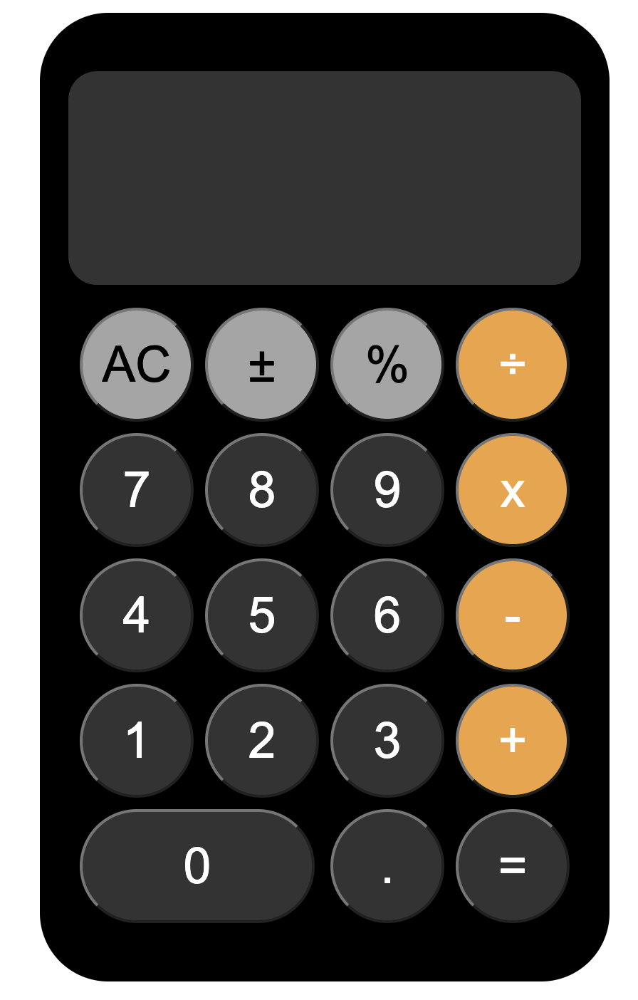

[👉 click here to view the page](https://msaiduslu.github.io/IOS-Calculator-Grid/)

# Project : Ios Calculator

## Description

- Create an IOS calculator with the CSS-GRID structure shown in the image.

### At the end of the project, following topics are to be covered;

- HTML

- CSS

### At the end of the project, i will be able to;

- improve coding skills within HTML & CSS

- use git commands (push, pull, commit, add etc.) and Github as Version Control System.
